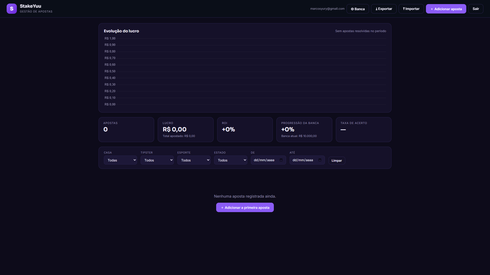

# StakeYuu 🎯

Gestor de apostas esportivas com banco de dados na nuvem — registre apostas, acompanhe lucro, ROI, taxa de acerto e a evolução da banca de qualquer dispositivo.

**🔗 Acesse: [marcosyurix.github.io/stakeyuu](https://marcosyurix.github.io/stakeyuu/)**

## Funcionalidades 

- 📊 **Dashboard completo** — gráfico de evolução do lucro, ROI, progressão da banca e taxa de acerto
- 📷 **Leitura de print (OCR)** — cole o print do bilhete e o app preenche cotação, valor, casa e título sozinho, direto no navegador
- ☁️ **Nuvem com login** — apostas salvas em banco PostgreSQL (Supabase), acessíveis do PC ou celular
- 🗂️ **Organização por mês** — abas mensais e totais por mês e por dia
- 🔍 **Filtros** — por casa de apostas, tipster, esporte, estado e período
- 🎰 **Estados de aposta** — pendente, ganha, perdida, anulada e cashout (com valor de retorno)
- 💾 **Backup** — exportação e importação em JSON

## Tecnologias

| Camada | Tecnologia |
|---|---|
| Frontend | HTML, CSS e JavaScript puro |
| Gráficos | Chart.js |
| OCR | Tesseract.js (roda 100% no navegador) |
| Banco + Auth | Supabase (PostgreSQL com Row Level Security) |
| Hospedagem | GitHub Pages |

Sem backend próprio: o frontend conversa direto com o Supabase, e as políticas RLS no banco garantem que cada usuário só acessa as próprias apostas.

## Rodando sua própria instância

1. Clone o repositório
2. Crie um projeto grátis no [Supabase](https://supabase.com) e rode o `supabase.sql` no SQL Editor
3. Em **Authentication → Sign In / Up → Email**, desative o "Confirm email"
4. Copie a Project URL e a anon key (Settings → API) para o topo do `js/app.js`
5. Abra o `index.html` ou hospede no GitHub Pages (Settings → Pages → deploy da branch `main`)

> A anon key pode ficar pública: a segurança vem das políticas RLS criadas pelo `supabase.sql`.

---

Feito por [MarcosYuriX](https://github.com/MarcosYuriX) 🟣
